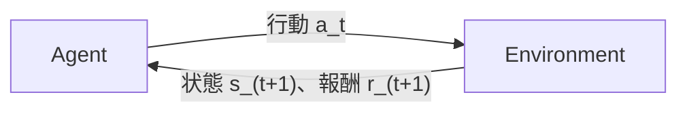
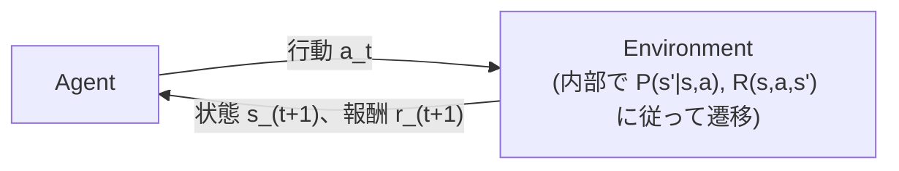

# 強化学習、ちゃんと勉強したことがなかったので基礎から整理してみた（バンディット〜DQN編）

## はじめに

普段は機械学習まわりの仕事をしているが、強化学習だけはずっと「用語はなんとなく知っている」レベルで止まっていた。教師あり学習や生成AIまわりは業務で触る機会が多かったが、強化学習は自分の担当領域と重ならず、ちゃんと手を動かして勉強したことがなかった。

最近、強化学習の考え方が必要になりそうなコンペに参加することになり、このタイミングで基礎から整理しておくことにした。用語だけ暗記しても身につかないので、今回は「強化学習の全体像→Gymnasiumの使い方→バンディット問題→マルコフ決定過程(MDP)→ベルマン方程式→動的計画法→モンテカルロ法→TD学習→DQN」という一連の流れを、実際に手を動かしながら整理する。

なお、本記事の理論構成は主に『ゼロから作るDeep Learning ❹ 強化学習編』を参考にしつつ、GymnasiumのAPIやPOMDP、実装上の注意点を追加して整理している。

## 1. 強化学習の全体像

### 1.1 Agent と Environment のループ

強化学習は、突き詰めると次のループの繰り返しでしかない。



Agent（エージェント）が時刻$t$の状態$s_t$を見て行動$a_t$を選ぶ。Environment（環境）はその行動を受け取り、次の状態$s_{t+1}$と報酬$r_{t+1}$を返す。これを$t=0,1,2,\dots$と、エピソードが終了するまで離散的な時刻ごとに繰り返す。教師あり学習と違って「正解ラベル」は与えられず、代わりに「報酬」という遅れた・断片的なフィードバックだけを頼りに、何が良い行動だったのかを逆算していく、というのが一番の違いだと理解している。

まずは、この最小限のやり取りに登場する用語だけを整理しておく。

| 用語 | 意味 |
|---|---|
| 状態 (state, $s$) | 環境の今の様子。エージェントが観測できる情報 |
| 行動 (action, $a$) | エージェントがその状態で取れる選択肢 |
| 報酬 (reward, $r$) | 1回の行動の結果として環境から返されるスカラー値。エージェントはこの合計を最大化したい |
| 方策 (policy, $\pi$) | 状態から行動を選ぶルール。決定的な方策なら$a=\pi(s)$、確率的な方策なら「状態$s$で行動$a$を選ぶ確率」$\pi(a \mid s)$として表す |
| エピソード | 初期状態から終了状態に至るまでの一連のやり取り。1回分の「試行」 |
| 収益 (return, $G_t$) | 時刻$t$以降にエピソード終了まで得られる、割引された報酬の合計。$G_t = r_{t+1} + \gamma r_{t+2} + \gamma^2 r_{t+3} + \dots = \sum_{k=0}^{\infty} \gamma^k r_{t+k+1}$ |
| 割引率 (discount factor, $\gamma$) | 将来の報酬を今の時点でどれだけ割り引いて評価するか（$0 \le \gamma \le 1$）。$\gamma$が1に近いほど将来の報酬を重視し、0に近いほど目先の報酬しか見なくなる |

### 1.2 強化学習の分類

一口に強化学習と言っても、切り口がいくつかある。これを最初に整理しておかないと、後で出てくる手法（動的計画法・モンテカルロ法・TD学習・DQN）が全体のどこに位置づくのか分からなくなる。

**モデルベース vs モデルフリー**

ここでの「モデル」とは、環境がどう振る舞うかを表す数理モデル、具体的には状態遷移確率$P(s'\mid s,a)$と報酬関数$R(s,a,s')$のことを指す（詳しくは4節で定義する）。このモデルが最初から分かっている、あるいは経験から推定して使う手法をモデルベースと呼ぶ。モデルを一切構築せず、環境と実際にやり取りして得たサンプル（経験）だけから直接価値関数や方策を学習する手法をモデルフリーと呼ぶ。今回扱う動的計画法はモデルが完全に分かっている前提の手法で、モンテカルロ法・TD学習・DQNはモデルフリーの手法にあたる。

**価値ベース vs 方策ベース vs Actor-Critic**

価値ベースの手法は、状態や状態行動対の「価値」（そこから先どれだけ良い結果が期待できるか）を推定し、価値が高くなる行動を選ぶという間接的なやり方で方策を決める。方策ベースの手法は、価値関数を経由せず、方策$\pi_\theta(a\mid s)$自体をパラメータ$\theta$で直接表現し、期待収益が大きくなる方向にパラメータを直接更新する（方策勾配法）。Actor-Criticは、方策（Actor）を価値関数（Critic）で評価しながら両方を同時に学習する、両者のハイブリッドにあたる。本記事では価値ベースの手法だけを扱い、方策ベース・Actor-Criticは扱わない。

**On-policy vs Off-policy**

On-policyの手法は、基本的に「今まさに学習対象にしている方策、あるいはそれに十分近い方策」から得たデータを使って学習する。方策が更新されるとデータを集めた時点の方策との間にずれが生じるため、過去のデータを無制限に再利用することはできない（重要度サンプリングなどで補正するテクニックもあるが、それでも自由度には限りがある）。Off-policyの手法は、データを集めるための方策（挙動方策, behavior policy）と、学習・評価の対象にしたい方策（目標方策, target policy）を明確に分離できるため、過去の（別の方策による）データをより自由に再利用したり、ランダムに探索しながら同時に貪欲な方策を学習したりできる。後述するQ学習はOff-policy、SARSAはOn-policyの代表例として紹介する。

**表形式 (tabular) vs 関数近似 (function approximation)**

状態や行動の数が少なく、すべての組み合わせを配列やテーブルとして持てるなら、状態（行動）ごとに価値を1つずつ記録する表形式の手法が使える。状態が連続値だったり、組み合わせ数が膨大だったりしてテーブルを持てない場合は、ニューラルネットなどのパラメータ付き関数で価値関数を近似する必要がある。

本記事で扱う動的計画法、モンテカルロ制御、SARSA、Q学習、DQNは、いずれも価値関数の推定を中心に方策を改善する**価値ベース**の手法として扱う（モンテカルロ法やTD学習という名前自体は、後述のActor-CriticのCritic部分など、価値ベース以外の文脈でも使われる、より広い概念であることには注意）。動的計画法・モンテカルロ法・TD学習は表形式、DQNは関数近似（ニューラルネットによる近似）の代表例として扱う。

## 2. Gymnasiumとは何か

理論の話に入る前に、この先ずっと実装で使うライブラリ自体を、章を分けてきちんと理解しておく。

### 2.1 Gymnasiumの位置づけ

Gymnasiumは、強化学習の環境（Environment）を統一的なインターフェースで扱うためのPythonライブラリ。元々は2016年にOpenAIが公開した`Gym`というライブラリで、強化学習の実装・研究における事実上の標準になっていたが、OpenAIによる開発が停滞したため、2021年以降はFarama Foundationという非営利団体がフォークして`Gymnasium`という名前で開発を引き継いでいる。今回インストールされているのはこの`Gymnasium`(v1.2.0)。

Gymnasiumが提供している価値は、「どんな環境であっても、共通の型（`Env`クラス）に従ってさえいれば、アルゴリズム側のコードを一切変えずに動かせる」という抽象化にある。表形式のFrozenLakeで書いたQ学習のコードも、連続値のCartPoleで書いたDQNのコードも、「`env.reset()`と`env.step()`を呼ぶ」という骨格は完全に同じにできる。これが、様々な環境に対して同じアルゴリズムを使い回せる理由になっている。

### 2.2 Envクラスの基本インターフェース

すべての環境は`gymnasium.Env`を継承していて、最低限次の4つを持つ。

| メソッド/属性 | 役割 |
|---|---|
| `reset(seed=None, options=None)` | エピソードを初期状態に戻す。`(observation, info)`を返す |
| `step(action)` | 行動を1つ受け取り、環境を1ステップ進める。`(observation, reward, terminated, truncated, info)`を返す |
| `observation_space` | 観測（状態）がどんな形・範囲を取りうるかを表す`Space`オブジェクト |
| `action_space` | 行動がどんな形・範囲を取りうるかを表す`Space`オブジェクト |

このほかに、後述する`render()`（描画）や`close()`（後片付け）もよく使う。`reset()`の`seed`引数は環境の乱数生成器を初期化するためのもので、同じ`seed`を渡せば同じ初期状態・同じ遷移が再現できる（今回の記事のコード例で`rng = np.random.default_rng(0)`のように乱数シードを固定しているのも同じ理由で、再現性を保つため）。

### 2.3 `observation_space`/`action_space`とSpaceクラス

これらは`gymnasium.spaces`にある`Space`のサブクラスのインスタンスで、観測や行動の「型」を表現する。代表的なものを整理する。

| Spaceクラス | 意味 | 例 |
|---|---|---|
| `Discrete(n)` | $0$から$n-1$までの整数のいずれか1つ | FrozenLakeの行動（上下左右の4つ）: `Discrete(4)` |
| `Box(low, high, shape, dtype)` | 指定した範囲の連続値ベクトル（多次元も可） | CartPoleの観測（カート位置・速度、棒の角度・角速度の4次元）: `shape=(4,)`の`Box` |
| `MultiDiscrete` | 複数の離散値の組み合わせ | （今回は未使用） |
| `MultiBinary` | 複数の0/1値の組み合わせ | （今回は未使用） |
| `Dict` / `Tuple` | 複数のSpaceを組み合わせた構造的な観測・行動 | （今回は未使用） |

`Space`オブジェクトは`.sample()`でランダムな値を1つ生成でき、`.contains(x)`でその値が有効な範囲に収まっているかを検証できる。アルゴリズム側のコードは、環境の中身を知らなくても、この`observation_space`/`action_space`を見るだけで「何次元のベクトルを受け取り、何種類の行動を返せばいいか」を判断できる。実際、8節のDQNの実装で`n_obs = env.observation_space.shape[0]`のようにネットワークの入出力サイズを環境から動的に決めているのは、このおかげ。

### 2.4 `step()`が返す5つの値

`step(action)`が返す`(observation, reward, terminated, truncated, info)`のうち、特に`terminated`と`truncated`の区別が重要になる。

- `terminated`: **環境（MDP）自身の定義上、終端状態に達したことによる終了**。CartPoleなら棒が倒れきった、FrozenLakeなら穴に落ちた・ゴールに着いた、など。理論上、終端状態の価値は0と定義されるため、価値関数を更新する際にこの先の価値を足し込んではいけない
- `truncated`: **MDPの定義そのものとは無関係な、外部要因による打ち切り**。典型的には「最大ステップ数に達した」という時間制限。本来のMDPとしてはまだエピソードが続く可能性があるので、理論的には打ち切られた状態の価値を（もし分かるなら）加味すべきだが、今回のように実装を簡略化する場合は`terminated`と同じ扱いにしてしまうことも多い。ここは実装上の妥協点として、本記事でも`done = terminated or truncated`として区別せずに扱っている箇所がある
- `info`: デバッグや診断のための補助的な辞書。方策の意思決定に使うべきではない付加情報（例えば「本当は何ステップ経過したか」等）が入ることがある

`terminated`と`truncated`が分離される前、古い`Gym`のAPIでは`done`という1つのフラグにまとめられていた。しかし「本当にゲームが終わったのか」と「時間切れで打ち切られただけなのか」を区別できないと、価値関数の更新（特にTD学習やDQNのブートストラップ）で理論的に間違った計算をしてしまう危険があるため、Gymnasiumで明示的に分離された、という経緯がある。

### 2.5 環境の指定方法（`gym.make`・レジストリ・Wrapper）

`gym.make("CartPole-v1")`のような文字列は、Gymnasium内部のレジストリに登録された`EnvSpec`（環境の仕様）を検索するためのID。慣習として`名前-vバージョン番号`という形式を取る。

`gym.make`はこのIDから対応する環境クラスをインスタンス化するだけでなく、必要に応じて`Wrapper`と呼ばれる仕組みで環境を包んで返す。`Wrapper`は環境の外側に被せて機能を追加するデコレータのようなもので、例えば`TimeLimit`という`Wrapper`は「一定ステップ数を超えたら`truncated=True`を返す」という機能を、環境自体のコードを変更せずに追加している。`CartPole-v1`の場合、`env.spec`を見ると`max_episode_steps=500`と設定されており、500ステップに達するとこの`TimeLimit`ラッパーが自動的に`truncated=True`を返す。

ラッパーを剥がした素の環境が欲しい場合は`env.unwrapped`でアクセスできる（後述のFrozenLakeで、状態遷移確率のテーブルに`env.unwrapped.P`としてアクセスするのはこのため。`P`はラップされる前の環境クラス自身が持つ属性で、`Wrapper`越しには直接見えない）。

### 2.6 その他よく使う機能

今回の記事では直接使わないが、知っておくと役立つ機能もまとめておく。

- **`render_mode`**: `gym.make(id, render_mode="human")`のように指定すると、`step()`のたびに画面へ描画してくれる。`render_mode="rgb_array"`にすると、代わりに画像データ（numpy配列）を`env.render()`で取得でき、動画として保存したり後から可視化したりできる
- **`close()`**: 環境が確保したリソース（描画ウィンドウなど）を解放する。特に`render_mode="human"`を使った場合は、使い終わったら明示的に呼ぶのがマナー
- **`Wrapper`の自作**: `TimeLimit`のような組み込みのラッパー以外にも、`gymnasium.Wrapper`を継承すれば「報酬を正規化する」「観測をスタックする」といった独自の前処理を、環境自体のコードに手を入れずに追加できる。よく使われる`RecordEpisodeStatistics`というラッパーは、エピソードごとの収益や長さを自動的に記録してくれる
- **ベクトル化環境 (Vectorized Environment)**: `gymnasium.vector.SyncVectorEnv`や`gym.make_vec(id, num_envs=N)`を使うと、同じ環境のコピーを複数同時に動かし、まとめて`step()`できる。DQNや方策勾配法をスケールさせる際に、経験を並列に集める目的でよく使われる
- **カスタム環境の登録**: 自作の`Env`サブクラスを`gymnasium.register(id=..., entry_point=...)`で登録しておけば、組み込みの環境と同じように`gym.make("MyEnv-v0")`で呼び出せるようになる。既存の環境で用が足りない場合、この仕組みで自分の問題をGymnasiumのエコシステムに乗せられる

### 2.7 実際に動かしてみる

概念を確認したところで、実際に動かして出力を見ておく。

```python
import gymnasium as gym

env = gym.make("CartPole-v1")
env.action_space.seed(0)  # action_space.sample()の乱数もここで固定する
obs, info = env.reset(seed=0)  # 最初の1回だけseedを渡す
print("reset:", obs.round(3), info)

for _ in range(5):
    action = env.action_space.sample()  # ランダムに行動を選ぶ
    obs, reward, terminated, truncated, info = env.step(action)
    print(f"obs={obs.round(3)}, reward={reward}, terminated={terminated}, truncated={truncated}, info={info}")
    if terminated or truncated:
        obs, info = env.reset()  # 2回目以降はseedを渡さない
env.close()

print("observation_space:", env.observation_space)
print("action_space:", env.action_space)
print("spec:", env.spec)
```

```
reset: [ 0.014 -0.023 -0.046 -0.048] {}
obs=[ 0.013  0.173 -0.047 -0.355], reward=1.0, terminated=False, truncated=False, info={}
obs=[ 0.017  0.368 -0.054 -0.662], reward=1.0, terminated=False, truncated=False, info={}
obs=[ 0.024  0.564 -0.067 -0.971], reward=1.0, terminated=False, truncated=False, info={}
obs=[ 0.035  0.37  -0.087 -0.701], reward=1.0, terminated=False, truncated=False, info={}
obs=[ 0.043  0.176 -0.101 -0.436], reward=1.0, terminated=False, truncated=False, info={}
observation_space: Box([-4.8               -inf -0.41887903        -inf], [4.8               inf 0.41887903        inf], (4,), float32)
action_space: Discrete(2)
spec: EnvSpec(id='CartPole-v1', entry_point='gymnasium.envs.classic_control.cartpole:CartPoleEnv', reward_threshold=475.0, nondeterministic=False, max_episode_steps=500, order_enforce=True, disable_env_checker=False, kwargs={}, namespace=None, name='CartPole', version=1, additional_wrappers=(), vector_entry_point='gymnasium.envs.classic_control.cartpole:CartPoleVectorEnv')
```

環境自体の乱数（`reset(seed=...)`）と、`action_space.sample()`が使う乱数は別の生成器で管理されているため、行動のサンプリングまで再現したい場合は`env.action_space.seed(0)`を別途呼ぶ必要がある。また、`seed`は最初の`reset()`で1度指定すれば、以降のエピソードでは`reset()`を`seed`無しで呼ぶのが一般的な使い方になる（毎回同じ`seed`を渡すと、毎エピソード全く同じ初期状態に戻ってしまう）。

`observation_space`が`Box`で4次元、`action_space`が`Discrete(2)`（カートを左右どちらに押すかの2択）になっているのが、2.3節で説明した通りに確認できる。`spec`を見ると`max_episode_steps=500`が実際に設定されており、CartPoleは棒が倒れる（`terminated`）か500ステップ生き延びて打ち切られる（`truncated`）かのどちらかでエピソードが終わる設計になっていることが分かる。`reward_threshold=475.0`は、この環境が「解けた」とみなされる目安として`EnvSpec`に設定されている値（評価時の基準の1つであり、評価に使うエピソード数まで規定しているわけではない）で、この値自体はGymnasiumのバージョンによって変更される可能性がある点には注意しておく。9節のDQNで学習が進んでいるかを見る際の大まかな目安として使う。

この後の全部の実装は、結局「`env.reset()`と`env.step()`をどう呼び、その結果（特に価値関数の更新において`terminated`かどうか）をどう使って価値関数や方策を更新するか」のバリエーションでしかない。

## 3. バンディット問題

強化学習の中で一番単純な設定から始める。**$k$本腕バンディット問題($k$-armed bandit problem)**と呼ばれるもので、$k$個の選択肢（アーム, arm）の中からどれか1つを繰り返し選び続け、得られる報酬の合計を最大化する。1節で整理した「状態」が登場しない、一番縮退したケースにあたる（後で登場するGymnasiumの実装では、形式を合わせるために「常に同じダミーの状態」を返すことにする）。

### 3.1 行動価値とその推定

各アーム$a$には、本当の期待報酬（真の行動価値, true action-value）

$$
q_*(a) = \mathbb{E}[R \mid A=a]
$$

が存在するが、エージェントはこれを知らない。分かっているのは、これまでにそのアームを選んだ結果の報酬だけ。そこでエージェントは、時刻$t$までにアーム$a$を選んで得た報酬の**標本平均**を、行動価値の推定値$Q_t(a)$として使う。

$$
Q_t(a) = \frac{\text{アーム$a$を選んで得た報酬の合計}}{\text{アーム$a$を選んだ回数}}
$$

この推定値が真の値$q_*(a)$に近ければ近いほど、それを頼りに正しくアームを選べるようになる、というのがバンディット問題の基本方針になる。

### 3.2 探索と活用のトレードオフ

ここで本質的な難しさになるのが、**探索(exploration)と活用(exploitation)のトレードオフ**。今の推定値$Q_t(a)$が一番高いアームを選び続ける（活用）だけでは、まだ試行回数が少なくて過小評価されているだけの、実は本当はもっと良いアームを見逃したままになるかもしれない。かといって毎回ランダムに選ぶ（探索）だけでは、分かったことを活かせず、平均的な報酬が最適値より低いままになってしまう。

最も単純な対処法が**ε-greedy方策**: 確率$\varepsilon$でランダムに探索し（すべてのアームを均等な確率で選ぶ）、確率$1-\varepsilon$で今の推定値が一番高い（greedyな）アームを選ぶ。

$$
A_t =
\begin{cases}
\arg\max_a Q_t(a) & \text{確率 } 1-\varepsilon \text{ で（活用）} \\
\text{ランダムなアーム} & \text{確率 } \varepsilon \text{ で（探索）}
\end{cases}
$$

$\varepsilon=0$なら常に活用のみ（一度でも悪い推定を引くと抜け出せなくなるリスクがある）、$\varepsilon=1$なら常に探索のみ（分かったことを一切活かせない）という両極端になる。この間のどこかにバランスの良い値がある、という考え方。ちなみに他にも「不確実性が高い（あまり試していない）アームほど積極的に選ぶ」UCB(Upper Confidence Bound)や、「最初にすべてのアームの推定値を楽観的に高く初期化しておき、自然と一通り試させる」楽観的初期値法など、探索を促す工夫は他にもいくつかあるが、今回はもっとも基本的なε-greedyだけを扱う。

### 3.3 標本平均の増分更新式

$Q_n(a)$を毎回律儀に「合計 ÷ 回数」で計算し直すのは無駄が多い。アーム$a$を$n$回選んで得た報酬を$R_1, R_2, \dots, R_n$とし、$n$回目までの標本平均を$Q_n$（$n$回目の観測を反映した後の推定値）と書くと、

$$
Q_n = Q_{n-1} + \frac{1}{n}\bigl(R_n - Q_{n-1}\bigr)
$$

という関係式が成り立つ（$Q_n$の定義から代数的に導ける）。これは「新しい推定値 = 古い推定値 + ステップサイズ × (新しい観測値 − 古い推定値)」という形をしていて、$(R_n - Q_{n-1})$の部分が**誤差(error)**、それに掛かる$\frac{1}{n}$が**ステップサイズ**にあたる。実装の`counts[a] += 1; Q[a] += (reward - Q[a]) / counts[a]`は、`counts[a]`を先に1増やしてから（これが$n$）、その$n$で割っているので、この式とそのまま対応している。この「推定値を、新しい観測との誤差の分だけ少しずつ修正していく」という更新の形は、この後8節で登場するTD学習の更新式（TD誤差を使って価値を更新する）の原型になっていて、実際に手を動かしてみて初めて、両者が同じ発想の上に成り立っていることが腑に落ちた。

### 3.4 Gymnasiumでバンディット環境を実装する

2.6節で「自作の`Env`を`gymnasium.register`で登録すれば、組み込みの環境と同じように扱える」という話をしたが、実はGymnasiumには標準でバンディット環境が用意されていない（`FrozenLake`や`CartPole`のような「状態が変化する」環境が中心で、バンディットのような縮退した問題は想定されていない）。そこで、ちょうど良い題材として、自分で最小限のバンディット環境を`gymnasium.Env`として実装してみる。

状態が存在しないバンディットを無理やり`Env`の形に当てはめるため、次のように設計した。

- `observation_space`: `Discrete(1)`。常に`0`という同じ値を返す「状態が無いこと」を表すダミーの観測
- `action_space`: `Discrete(n_arms)`。どのアームを選ぶか
- `step(action)`: 選んだアームの真の期待値を平均とする正規分布から報酬をサンプルして返す。バンディットの1回の「アームを引く」行為はそれ単独で完結するので、`terminated=True`を返して即座にエピソードを終える（1回引く = 1エピソード、という扱いにする）

```python
import gymnasium as gym
from gymnasium import spaces
import numpy as np


class BanditEnv(gym.Env):
    """k本腕バンディット問題をGymnasiumのEnvとして実装したもの。"""

    def __init__(self, true_means):
        super().__init__()
        self.true_means = np.array(true_means)
        self.n_arms = len(true_means)
        self.observation_space = spaces.Discrete(1)
        self.action_space = spaces.Discrete(self.n_arms)

    def reset(self, seed=None, options=None):
        super().reset(seed=seed)  # self.np_random がここで初期化される
        return 0, {}

    def step(self, action):
        reward = self.np_random.normal(self.true_means[action], 1.0)
        return 0, reward, True, False, {}  # terminated=True: 1回引いたら即終了
```

`super().reset(seed=seed)`を呼ぶと、親クラスの`gymnasium.Env`が`self.np_random`という`numpy.random.Generator`をシードして用意してくれるので、これを使って報酬をサンプルしている。

これをε-greedyで動かす。

```python
rng = np.random.default_rng(0)
true_means = rng.normal(0, 1, size=5)  # 5本のアームの本当の期待報酬（未知という設定）
env = BanditEnv(true_means)

n_arms = env.action_space.n
epsilon = 0.1
n_steps = 2000

Q = np.zeros(n_arms)       # 各アームの推定価値
counts = np.zeros(n_arms)  # 各アームを選んだ回数
action_rng = np.random.default_rng(1)
total_reward = 0.0

for t in range(n_steps):
    obs, info = env.reset()  # 1回引く = 1エピソードなので、毎回リセットする
    if action_rng.random() < epsilon:
        a = action_rng.integers(n_arms)
    else:
        a = int(np.argmax(Q))
    obs, reward, terminated, truncated, info = env.step(a)
    counts[a] += 1
    Q[a] += (reward - Q[a]) / counts[a]  # 3.3節の増分更新式
    total_reward += reward
```

実行すると、こうなった。

```
observation_space: Discrete(1)
action_space: Discrete(5)
true means: [ 0.13 -0.13  0.64  0.1  -0.54]
estimated Q: [-0.   -0.32  0.61  0.35 -0.47]
best arm (true): 2  best arm (estimated): 2
average reward: 0.556
```

2000ステップの試行錯誤だけで、本当に一番良いアーム（真の期待値0.64のアーム2）を正しく見つけられている。バンディット問題自体には「状態」が無いので、`Env`としての恩恵（観測から次の行動を決める、状態遷移を扱う）はまだほとんど活きていないが、次のMDPからは状態がちゃんと意味を持ってくる。

## 4. マルコフ決定過程（MDP）

バンディット問題には「状態」がなかったが、現実の問題はたいてい状態が変化していく。これを定式化したのがMDP(Markov Decision Process)で、次の4つ組（+割引率）で表される。

### 4.1 MDPの定義

- 状態集合 $S$
- 行動集合 $A$
- 遷移確率 $P(s'\mid s,a)$（状態$s$で行動$a$を取ったとき、状態$s'$に移る確率）
- 報酬関数 $R(s,a,s')$
- 割引率 $\gamma$（1節で登場したもの）

この5つ組（$S, A, P, R, \gamma$）がMDPの正体で、1節で「エージェントと環境のループ」として説明した内容を、数学的に定式化しただけのものになる。なお、報酬関数の定義の仕方は文献によって流儀があり、遷移先$s'$には依存しない$r(s,a) = \mathbb{E}[R_{t+1} \mid s_t=s, a_t=a]$として定義したり、遷移先と報酬をまとめた同時分布$p(s',r\mid s,a)$として定義したりすることもある。本記事では、遷移先にも依存する$R(s,a,s')$という書き方を採用する。**ループの構造そのものは1節の図から何も変わっておらず**、単に「Environment」という箱の中身が「$P(s'\mid s,a)$に従って次の状態を決め、$R(s,a,s')$に従って報酬を決める」という具体的な仕組みだと分かった、というだけの違いしかない。



### 4.2 マルコフ性

**マルコフ性(Markov property)**とは、「次の状態の確率分布は、直前の状態と行動だけで決まり、それ以前の履歴を追加で知っても分布は変わらない」という性質のこと。式で書くとこう。

$$
P(s_{t+1} \mid s_t, a_t, s_{t-1}, a_{t-1}, \dots, s_0, a_0) = P(s_{t+1} \mid s_t, a_t)
$$

右辺と左辺が等しい、つまり「$s_0$から$s_{t-1}$までの過去の経路」を追加で知っても、次の状態の予測は一切変わらない、というのがこの式の意味。この性質があるおかげで、価値関数や方策は「今の状態$s_t$」だけを入力にすればよく、過去の全履歴を状態として持ち歩く必要がなくなる。5節以降で出てくる価値関数がすべて$V(s)$のように「今の状態」だけの関数として書けているのは、このマルコフ性を前提にしているから。

**マルコフ性が成立しない例**

一方で、現実の多くの問題は素直にはマルコフ性を満たさない。典型的なのが、**エージェントが真の状態を直接観測できず、部分的な観測しか得られない**設定で、これは**POMDP(Partially Observable MDP)**と呼ばれる。

例えば、相手の手札が見えないカードゲームを考える。真の状態（両プレイヤーの手札・山札の並び・場の状況すべて）を誰か（審判のような存在）が完全に把握しているなら、その真の状態はマルコフ性を満たす（次の状態は今の真の状態と行動だけで決まる）。しかし、実際にプレイしているエージェントの視点からは、相手の手札や山札の中身は見えない。エージェントが受け取れるのは、真の状態の一部だけを切り出した**観測(observation)**であり、この観測だけを「状態」として扱うと、マルコフ性は一般に成り立たなくなる。同じ観測を受け取っていても、それまでの手の流れ（何を引いた、何を切った、何を伏せた）によって、次に起こりうることの確率分布が変わってしまうから。

このような場合、観測の履歴全体（あるいは相手の手札を確率的に推測した**信念状態, belief state**）を使えば、理論上はマルコフ性を回復できる。つまり「1手前の観測」ではなく「これまでの観測・行動の履歴を集約した、真の状態についての確率分布」を状態として扱えば、その信念状態の系列はマルコフ性を満たす。ただしこれは、単純に毎回渡される観測をそのまま使うだけでは済まず、エージェント自身が過去の情報を記憶・更新し続ける必要があることを意味する。

本記事で扱う範囲（バンディット〜DQN）はすべて、エージェントが真の状態を完全に観測できる、素直なMDPを前提にしている。相手の手札が見えないような不完全情報のゲームでこの前提が崩れたときにどう対処するかは、次の記事（ゲーム木探索・MCTS・determinization）で扱う。

### 4.3 MDPを解くとは何か

$S, A, P, R, \gamma$を定義しただけでは、まだ何も「解けて」いない。MDPを解く、というのは、1節で定義した方策$\pi$のうち、**期待収益を最大化するもの**を見つけることを指す。まず、方策$\pi$に従ったときの状態$s$の価値を$V^\pi(s) = \mathbb{E}_\pi[G_t \mid s_t=s]$（5節で改めて詳しく扱う）とし、その最大値を

$$
V^*(s) = \max_{\pi} V^\pi(s)
$$

と定義する。この$V^*(s)$を、**すべての**状態$s$について同時に達成する方策——つまり、どの状態から始めても$V^\pi(s) = V^*(s)$を満たす方策——を**最適方策(optimal policy)**と呼び、$\pi_*$と書く。

ただ、この式を見ただけでは「どうやって$\pi_*$を見つけるのか」はまだ分からない。すべての方策$\pi$を虱潰しに試して期待収益を比較する、というのは現実的ではない。そこで必要になるのが、「ある方策・ある状態がどれくらい良いか」を数値として評価する**価値関数**という道具で、これを使うと$\pi_*$を効率的に求める手立てが得られる。これが次の5節（ベルマン方程式）の主題になる。

### 4.4 Gymnasiumで覗いてみる

Gymnasiumの`FrozenLake-v1`は、MDPの構成要素がそのまま覗ける良い教材だった。4x4の氷の上を歩いてゴールを目指す環境で、氷が滑るので行動通りに動くとは限らない。この環境はエージェントが今どのマスにいるかを完全に観測できる（隠された情報が無い）ので、素直なMDPになっている。

```python
import gymnasium as gym

env = gym.make("FrozenLake-v1", is_slippery=True)
print(env.observation_space, env.action_space)
P = env.unwrapped.P
print(P[0][0])  # 状態0で行動0(左)を選んだ場合の遷移
```

```
Discrete(16) Discrete(4)
[(0.3333333333333333, 0, 0.0, False), (0.3333333333333333, 0, 0.0, False), (0.3333333333333333, 4, 0.0, False)]
```

`(遷移確率, 遷移先の状態, 報酬, 終了フラグ)` のタプルが3つ並んでいる。「左に進む」という行動を選んでも、氷が滑るせいで実際には1/3の確率でしか意図通りに動かず、残りは横に滑ってしまう、というのがそのまま数値で表現されている。これがまさに`P(s'|s,a)`の実体。

## 5. ベルマン方程式

4節の最後で、「MDPを解く＝最適方策$\pi_*$を見つけること」であり、そのために「状態や方策の良さ」を評価する道具が要る、という話をした。それが**価値関数**で、価値関数同士の関係を表すのが本節の主題である**ベルマン方程式**になる。

### 5.1 状態価値関数と行動価値関数

**状態価値関数(state-value function)** $V^\pi(s)$は、方策$\pi$に従い続けたとき、状態$s$から先に得られる収益の期待値。

$$
V^\pi(s) = \mathbb{E}_\pi\bigl[G_t \mid s_t = s\bigr]
$$

**行動価値関数(action-value function)** $Q^\pi(s,a)$は、状態$s$でまず行動$a$を取り、それ以降は方策$\pi$に従った場合の収益の期待値。

$$
Q^\pi(s,a) = \mathbb{E}_\pi\bigl[G_t \mid s_t = s, a_t = a\bigr]
$$

両者は「最初の1手を固定するかどうか」だけの違いで、次の関係で結びついている。

$$
V^\pi(s) = \sum_a \pi(a\mid s)\, Q^\pi(s,a)
$$

状態$s$の価値は、その状態で取りうる各行動の価値$Q^\pi(s,a)$を、方策$\pi$に従って選ぶ確率で重み付けした期待値になっている。

### 5.2 ベルマン期待方程式

収益$G_t$は、定義上$G_t = r_{t+1} + \gamma G_{t+1}$（今もらう報酬 + 割引した「1手先から見た収益」）という再帰的な関係を持つ。この関係をそのまま$V^\pi(s)$の定義に代入すると、$V^\pi(s)$自身を、1手先の$V^\pi(s')$を使って表せる。これが**ベルマン期待方程式(Bellman expectation equation)**。

$$
V^\pi(s) = \sum_a \pi(a\mid s) \sum_{s'} P(s'\mid s,a) \left[ R(s,a,s') + \gamma V^\pi(s') \right]
$$

「今の状態の価値 = （方策に従って行動を選び、遷移確率に従って次の状態に移った上での）次に得る報酬 + 割引した次の状態の価値、の期待値」という関係を表しているだけで、式自体は複雑に見えるが構造は単純だった。同じことを$Q^\pi$についても書ける。

$$
Q^\pi(s,a) = \sum_{s'} P(s'\mid s,a) \left[ R(s,a,s') + \gamma \sum_{a'} \pi(a'\mid s') Q^\pi(s',a') \right]
$$

この方程式が便利なのは、「全状態の$V^\pi$」を未知数とする連立一次方程式とみなせる点にある。状態数が$n$個なら、$n$個の未知数と$n$個の式があるので、原理的には解ける。

### 5.3 ベルマン最適方程式

$V^\pi$は「特定の方策$\pi$のもとでの価値」だったが、本当に欲しいのは「最適方策$\pi_*$のもとでの価値」、つまり**最適状態価値関数** $V^*(s) = \max_\pi V^\pi(s)$ の方。これが満たす式が**ベルマン最適方程式(Bellman optimality equation)**。

$$
V^*(s) = \max_a \sum_{s'} P(s'\mid s,a) \left[ R(s,a,s') + \gamma V^*(s') \right]
$$

5.2節の期待方程式との違いは、「方策$\pi$に従って行動を選んだ場合の期待値（$\sum_a \pi(a\mid s)(\dots)$）」の代わりに、「一番価値が高くなる行動を選ぶ（$\max_a (\dots)$）」に置き換わっただけ。行動価値関数についても同様に書ける。

$$
Q^*(s,a) = \sum_{s'} P(s'\mid s,a) \left[ R(s,a,s') + \gamma \max_{a'} Q^*(s',a') \right]
$$

ここで重要なのが、$Q^*$さえ求まれば、最適方策$\pi_*$は**それぞれの状態で$Q^*(s,a)$が一番高い行動を選ぶだけ**で得られるという事実。

$$
\pi_*(s) = \arg\max_a Q^*(s,a)
$$

つまり「最適方策を探す」という問題は、「$Q^*$（あるいは$V^*$）を求める」という問題に置き換えられる。6節以降で扱う動的計画法・モンテカルロ法・TD学習・DQNは、どれも突き詰めると「この$V^*$や$Q^*$を、それぞれ違うやり方で求めようとしている」という点で共通していて、これが今回の一連の記事を通しての縦糸になる。

### 5.4 Gymnasiumで確認する

抽象的な式だけでは実感が湧かないので、5.2節のベルマン期待方程式を実際に解いてみる。$V^\pi$についての式は、$V^\pi$を未知数とする連立一次方程式とみなせるので、行列の形に整理すれば直接解ける。

$$
V^\pi = R^\pi + \gamma P^\pi V^\pi \quad \Longrightarrow \quad V^\pi = (I - \gamma P^\pi)^{-1} R^\pi
$$

ここで$P^\pi$は「方策$\pi$のもとでの状態遷移確率行列」（$P^\pi_{s,s'} = \sum_a \pi(a\mid s) P(s'\mid s,a)$）、$R^\pi$は「方策$\pi$のもとでの期待報酬」（$R^\pi_s = \sum_a \pi(a\mid s) \sum_{s'} P(s'\mid s,a) R(s,a,s')$）。試しに、FrozenLakeで「毎回4方向を等確率で選ぶ、一様ランダムな方策」の価値$V^\pi$を計算してみる。

```python
import numpy as np
import gymnasium as gym

env = gym.make("FrozenLake-v1", is_slippery=True)
P = env.unwrapped.P
n_states = env.observation_space.n
n_actions = env.action_space.n
gamma = 0.99

pi = np.ones((n_states, n_actions)) / n_actions  # 一様ランダム方策 pi(a|s) = 1/4

P_pi = np.zeros((n_states, n_states))
R_pi = np.zeros(n_states)
for s in range(n_states):
    for a in range(n_actions):
        for prob, next_s, reward, done in P[s][a]:
            P_pi[s, next_s] += pi[s, a] * prob
            R_pi[s] += pi[s, a] * prob * reward

V = np.linalg.solve(np.eye(n_states) - gamma * P_pi, R_pi)
```

```
V (random policy):
[[ 0.012  0.01   0.019  0.009]
 [ 0.015 -0.     0.039 -0.   ]
 [ 0.033  0.084  0.138  0.   ]
 [-0.     0.17   0.434  0.   ]]
```

ゴール手前の状態（右下, インデックス14）でも価値は0.434しかない。6節で価値反復法によって求める最適価値$V^*$（同じ状態で0.863だった）と比べると半分程度しかなく、「行動を考えずにランダムに動くだけの方策」と「最適方策」の差が、この数字の差として表れている。次の動的計画法は、この計算を「特定の方策の評価」から「最適方策の探索」に発展させたもの。

## 6. 動的計画法（DP）

環境のモデル（$P$と$R$）が完全に分かっている場合に、5節のベルマン方程式を使って最適方策を実際に求めるアルゴリズムが**動的計画法(Dynamic Programming, DP)**。ここでは代表的な3つの手法（方策評価・方策反復法・価値反復法）を、この順に積み上げて説明する。

### 6.1 方策評価 (Policy Evaluation)

方策$\pi$を1つ固定したとき、その$V^\pi$を求める手続きを**方策評価**と呼ぶ。5.4節では「連立一次方程式として直接解く」というやり方をしたが、状態数が多い実際の問題では逆行列の計算が重すぎることが多い。そこで代わりに、ベルマン期待方程式を**更新式**として繰り返し適用する。

$$
V_{k+1}(s) \leftarrow \sum_a \pi(a\mid s) \sum_{s'} P(s'\mid s,a) \left[ R(s,a,s') + \gamma V_k(s') \right]
$$

$V_0$を適当な値（すべて0など）から始めて、この更新をすべての状態に対して繰り返すと、$V_k$は$k\to\infty$で$V^\pi$に収束することが理論的に保証されている（縮小写像の不動点として）。5.4節でやった「連立方程式を1回で解く」方法と、ここでの「同じ式を繰り返し適用して近づける」方法は、同じ$V^\pi$という同じ答えに辿り着く、別の求め方だと捉えるとよい。

### 6.2 方策改善 (Policy Improvement)

$V^\pi$が求まったら、それを使ってより良い方策を作れないかを考える。具体的には、各状態で$V^\pi$から計算した行動価値$Q^\pi(s,a)$が一番高くなる行動を選ぶ、**greedyな新しい方策**$\pi'$を作る。

$$
\pi'(s) = \arg\max_a Q^\pi(s,a) = \arg\max_a \sum_{s'} P(s'\mid s,a)\left[R(s,a,s') + \gamma V^\pi(s')\right]
$$

**方策改善定理(Policy Improvement Theorem)**は、「この$\pi'$は、元の$\pi$以上に良い（すべての状態で$V^{\pi'}(s) \ge V^\pi(s)$）」ことを保証する。つまり、今の方策の価値を評価し、それに対して貪欲な方策を作り直せば、方策は悪化することなく改善（か現状維持）される。

### 6.3 方策反復法 (Policy Iteration)

方策評価と方策改善を交互に繰り返すのが**方策反復法(Policy Iteration)**。

1. 適当な方策$\pi$から始める
2. **方策評価**: $\pi$のもとでの$V^\pi$を（収束するまで）計算する
3. **方策改善**: $V^\pi$に対して貪欲な新しい方策$\pi'$を作る
4. $\pi' = \pi$（方策が変化しなくなった）なら終了。そうでなければ$\pi \leftarrow \pi'$として2に戻る

状態数・行動数が有限のMDPでは、方策反復法は有限回の繰り返しで必ず最適方策$\pi_*$に到達することが保証されている。ただし、ステップ2の「方策評価」を毎回きっちり収束するまで回すのは計算コストが高い。

### 6.4 価値反復法 (Value Iteration)

そこで、「方策評価を完全に収束させてから改善する」のをやめ、**方策評価をたった1回のスイープだけ行い、即座に貪欲な改善（$\max_a$を取る）に進む**、という極端な省略をしたのが**価値反復法(Value Iteration)**。方策評価と方策改善を毎回1ステップずつ同時に進めているとも言える。更新式は、期待方程式ではなくベルマン**最適**方程式をそのまま使う。

$$
V_{k+1}(s) \leftarrow \max_a \sum_{s'} P(s'\mid s,a) \left[ R(s,a,s') + \gamma V_k(s') \right]
$$

この更新を繰り返すと$V_k$は直接$V^*$に収束し、収束後に$\pi_*(s) = \arg\max_a Q^*(s,a)$を計算すれば最適方策が得られる。方策反復法のように「今の方策」を明示的に持ち歩く必要がなく、実装がシンプルになるので、今回はこちらを実装する。

### 6.5 Gymnasiumで実装する

```python
import numpy as np
import gymnasium as gym

env = gym.make("FrozenLake-v1", is_slippery=True)
P = env.unwrapped.P
n_states = env.observation_space.n
n_actions = env.action_space.n
gamma = 0.99

V = np.zeros(n_states)
for _ in range(1000):
    new_V = np.zeros(n_states)
    for s in range(n_states):
        action_values = [
            sum(prob * (reward + gamma * V[next_s] * (not done))
                for prob, next_s, reward, done in P[s][a])
            for a in range(n_actions)
        ]
        new_V[s] = max(action_values)
    if np.max(np.abs(new_V - V)) < 1e-8:
        V = new_V
        break
    V = new_V

# Vから貪欲に方策を作る
policy = np.zeros(n_states, dtype=int)
for s in range(n_states):
    action_values = [
        sum(prob * (reward + gamma * V[next_s] * (not done))
            for prob, next_s, reward, done in P[s][a])
        for a in range(n_actions)
    ]
    policy[s] = int(np.argmax(action_values))
```

2000回プレイさせて評価すると、こうなった。

```
V: [0.542 0.499 0.471 0.457 0.558 0.    0.358 0.    0.592 0.643 0.615 0.
    0.    0.742 0.863 0.   ]
policy: [0 3 3 3 0 0 0 0 3 1 0 0 0 2 1 0]
win rate: 0.7285
```

滑る氷という不確実性がある中でも、73%近い勝率を出せる方策が理論的に導けている。ただしこの方法は「環境の遷移確率を完全に知っている」ことが前提になっていて、現実の多くの問題ではこれが成り立たない。次のモンテカルロ法から先は、この前提を外していく。

## 7. モンテカルロ法

6節の動的計画法は、環境のモデル（$P$と$R$）が完全に分かっていることが前提だった。しかし現実の多くの問題では、遷移確率などそもそも分からない。ここからは、モデルを一切使わない**モデルフリー**な手法に入る。最初がモンテカルロ法(Monte Carlo methods)。

### 7.1 モンテカルロ法の発想

$V^\pi(s) = \mathbb{E}_\pi[G_t \mid s_t=s]$という定義に立ち返ると、これは「状態$s$から方策$\pi$に従い続けたときの収益$G_t$の期待値」だった。モンテカルロ法の発想は単純で、**期待値が分からないなら、実際に何度もサンプルを取ってその標本平均で近似すればよい**、というもの。具体的には、方策$\pi$に従って実際にエピソードを最後まで（終端状態に達するまで）走らせ、そのエピソードの中で状態$s$を訪れた時点から実際に得られた収益$G_t$を1サンプルとして記録する。これを何度も繰り返し、集まったサンプルの平均を$V^\pi(s)$の推定値とする。大数の法則により、サンプル数を増やせば増やすほど、この平均は真の$V^\pi(s)$に収束する。

環境のモデル$P$や$R$を一切使わず、実際に環境と相互作用して得られた経験だけから学習している点が、動的計画法との決定的な違いになる。

### 7.2 初回訪問 vs 全訪問

1回のエピソードの中で、同じ状態$s$（あるいは状態行動対$(s,a)$）に複数回訪れることがある（FrozenLakeでも、同じマスに滑って戻ってくることは普通に起こる）。この場合にどのサンプルを使うかで、2つの流儀がある。

- **初回訪問モンテカルロ法(first-visit MC)**: そのエピソードの中で、状態$s$に**最初に**訪れた時点からの収益だけをサンプルとして使う。2回目以降の訪問は無視する
- **全訪問モンテカルロ法(every-visit MC)**: 訪れるたびに、その時点からの収益をすべてサンプルとして使う

どちらも十分な数のエピソードを重ねれば真の$V^\pi$に収束することが知られているが、理論的な性質（初回訪問は各エピソードから独立なサンプルが1つだけ取れるので解析しやすい）から、初回訪問の方が教科書的にはよく使われる。今回の実装も初回訪問モンテカルロ法を使う。

### 7.3 モンテカルロ制御と探索の確保

ここまでは「固定した方策$\pi$を評価する」話だった。最適方策を見つける（モンテカルロ制御, Monte Carlo control）には、6節と同じ**方策評価→方策改善**の繰り返し（汎化方策反復, Generalized Policy Iteration）のアイデアを使う。つまり、サンプルから$Q^\pi(s,a)$を推定し、それに対して貪欲な新しい方策を作り、また評価する、を繰り返す。

ただし1つ大きな問題がある。**一度でも完全に貪欲な方策にしてしまうと、一部の状態行動対を二度と試さなくなり、その価値を正しく推定できないまま**になってしまう。すべての$(s,a)$を無限回試すことが理論上の収束条件なので、常に何らかの探索を残しておく必要がある。

古典的な解決策が2つ知られている。

- **Exploring Starts**: 各エピソードの開始点$(s_0, a_0)$を、あらゆる状態行動対から一様ランダムに選ぶ、という設定を仮定する。理論上はきれいだが、実環境では「任意の状態・行動から始める」こと自体ができないことが多く、現実的でない場合が多い
- **$\varepsilon$-soft方策**: 3節で登場したε-greedyのように、どの行動も確率$\varepsilon/|A|$以上で選ばれることを保証する方策を使う。これなら、貪欲な方策に寄せていっても、すべての行動が確率的に選ばれ続けるので探索が保証される

さらに、$\varepsilon$を学習の進行とともに**0に近づけていく**（それでも無限回の探索は保証しつつ、最終的にはほぼ貪欲な、最適に近い方策に収束させる）やり方は**GLIE(Greedy in the Limit with Infinite Exploration)**と呼ばれる条件を満たす代表的な設計で、これを満たせば理論上$Q$は$Q^*$に収束することが保証される。

ただし、次の実装で使う$\varepsilon$のスケジュールは、下限を$0.05$に固定していて、厳密には0に収束しない。したがって、この実装は厳密にはGLIE条件を満たしておらず、「理論上は最適方策に収束する」という保証をそのまま適用できる設定ではない。これは、有限のエピソード数の中で探索が枯渇してしまうのを避けるための実用上の妥協であり、下限を残した$\varepsilon$-soft方策として運用している、と理解するのが正確になる。

### 7.4 Gymnasiumで実装する

初回訪問モンテカルロ法を実装する際、素朴に「エピソードを逆順に走査し、まだ`visited`に入っていない状態行動対を更新する」と書きたくなるが、これは**罠**だった。逆順に走査すると、同じ状態行動対に複数回訪れているケースで、最初に`visited`に登録されるのはエピソードの中で**一番最後**に訪れた時点になってしまう。つまり「初回訪問」のつもりが実際には「最終訪問」になる。正しくは、各時刻の収益(returns-to-go)を先に（逆順で）計算してから、`visited`の判定自体は**順方向**に走査して行う。

```python
import numpy as np
import gymnasium as gym
from collections import defaultdict

env = gym.make("FrozenLake-v1", is_slippery=True)
n_states, n_actions = env.observation_space.n, env.action_space.n
gamma = 0.99
n_episodes = 200000

Q = np.zeros((n_states, n_actions))
returns_sum = defaultdict(float)
returns_count = defaultdict(int)
rng = np.random.default_rng(0)

for ep in range(n_episodes):
    epsilon = max(0.05, 1.0 - ep / (n_episodes * 0.5))  # 徐々に減衰させる
    obs, _ = env.reset()
    episode = []
    done = False
    while not done:
        a = rng.integers(n_actions) if rng.random() < epsilon else int(np.argmax(Q[obs]))
        next_obs, reward, terminated, truncated, _ = env.step(a)
        episode.append((obs, a, reward))
        obs = next_obs
        done = terminated or truncated

    # 各時刻の収益を先に(逆順で)計算しておく
    returns = np.zeros(len(episode))
    G = 0.0
    for t in reversed(range(len(episode))):
        _, _, reward = episode[t]
        G = reward + gamma * G
        returns[t] = G

    # visitedの判定は順方向に走査し、本当の「初回」訪問だけを使う
    visited = set()
    for t, (s, a, _) in enumerate(episode):
        if (s, a) in visited:
            continue
        visited.add((s, a))
        returns_sum[(s, a)] += returns[t]
        returns_count[(s, a)] += 1
        Q[s, a] = returns_sum[(s, a)] / returns_count[(s, a)]
```

最初、εを固定（$\varepsilon=0.1$）のまま20万エピソード回したところ、あまりうまくいかなかった。

```
win rate: 0.1575
```

価値反復法の73%近くに対して、16%弱にとどまった。原因を考えると、FrozenLakeは「ゴールに着いた時しか報酬が出ない」超スパースな環境で、探索が固定のまま（貪欲な行動に十分寄せきれない）だと、良い状態行動対の価値をなかなか正確に絞り込めない。7.3節の通り、εを固定のままにせず、学習が進むにつれて探索を減らす（εを減衰させる）ように直したところ、大きく改善した（コードは上の通り、$\varepsilon$の減衰込みのもの）。

```
win rate: 0.727
```

72.7%まで改善し、価値反復法の73%近く・後述するTD学習の73〜74%とほぼ同水準まで到達した（20万エピソード・約20秒）。修正前の実装（最終訪問になっていたバグ入りのもの）ではここまで綺麗には揃わなかったので、「初回訪問」という定義通りに実装できているかどうかは、思っていた以上に最終的な精度に効いてくる、というのが実装してみての発見だった。

最終的な精度では動的計画法・TD学習と大差ない結果に落ち着いたが、それでも20万エピソードという試行回数（TD学習の5万エピソードの4倍）が必要だった点に、モンテカルロ法が「エピソードが終わるまで待って、その結果だけを頼りに更新する」ため分散が大きく、収束に多くのサンプルを要するという性質が表れている。

## 8. TD学習

モンテカルロ法は「エピソードが終わるまで待って、実際に得られた収益$G_t$を使う」手法だった。これは動的計画法（モデルを使って計算するが、待たずに1手先の推定値を使う）とモンテカルロ法（モデルは使わないが、エピソード終了まで待つ）の、それぞれ良い部分だけを組み合わせられないか、という発想から生まれたのが**TD学習(Temporal Difference Learning)**。

### 8.1 TD(0)によるブートストラップ

一番単純な形がTD(0)で、状態価値の更新式はこう。

$$
V(s_t) \leftarrow V(s_t) + \alpha \left[ r_{t+1} + \gamma V(s_{t+1}) - V(s_t) \right]
$$

モンテカルロ法の更新式（$V(s_t) \leftarrow V(s_t) + \alpha[G_t - V(s_t)]$）と見比べると、「実際に得られた収益$G_t$」の代わりに「$r_{t+1} + \gamma V(s_{t+1})$」という、**1歩先の報酬と、自分自身の現在の価値推定を使って組み立てた見積もり**（TDターゲットと呼ぶ）を使っている点だけが違う。この「収益全体を実際に得るまで待たず、自分自身の推定値を使って先に進む」やり方を**ブートストラップ**と呼び、これによってエピソードの途中、1ステップごとに更新できるようになる。ターゲットと現在の推定値との差$\delta_t = r_{t+1} + \gamma V(s_{t+1}) - V(s_t)$を**TD誤差**と呼び、3.3節でバンディット問題の増分更新に出てきた「誤差を学習率倍だけ反映する」という更新の形と、まったく同じ構造をしている。

### 8.2 SARSA（on-policy TD制御）

TD(0)を行動価値$Q(s,a)$に拡張し、方策の改善まで行う（TD制御）方法の1つがSARSAで、更新式はこう。

$$
Q(s_t,a_t) \leftarrow Q(s_t,a_t) + \alpha \left[ r_{t+1} + \gamma Q(s_{t+1}, a_{t+1}) - Q(s_t,a_t) \right]
$$

名前の由来は、更新に使う一連の値 $(s_t, a_t, r_{t+1}, s_{t+1}, a_{t+1})$ の頭文字（State-Action-Reward-State-Action）から来ている。ここで重要なのは、$a_{t+1}$が**実際に方策（$\varepsilon$-greedyなど）に従って選ばれた、次の行動そのもの**である点。つまりSARSAは、「今まさに従っている方策（探索も含む）」の価値を評価しながら改善していく、1節で分類した**on-policy**な手法にあたる。

### 8.3 Q学習（off-policy TD制御）

一方、Q学習の更新式はこう。

$$
Q(s_t,a_t) \leftarrow Q(s_t,a_t) + \alpha \left[ r_{t+1} + \gamma \max_{a'} Q(s_{t+1}, a') - Q(s_t,a_t) \right]
$$

SARSAとの違いは、次の行動として「実際に選んだ$a_{t+1}$」ではなく、「次の状態でもっとも価値が高くなる行動（$\max_{a'}$）」を仮定して更新している点だけ。実際の行動選択には（探索のための）$\varepsilon$-greedy方策を使いながら、価値の更新自体は常に貪欲な行動を仮定して行う、つまり「データを集める方策」と「評価・学習の対象にしている方策（暗にgreedy方策）」が異なる、1節で分類した**off-policy**な手法にあたる。この性質のおかげで、Q学習は探索の仕方によらず、直接$Q^*$（最適行動価値関数）を学習できることが理論的に保証されている。

SARSAとQ学習の違いが挙動として顕著に現れる例として、崖に沿った近道と、遠回りだが安全な道がある`CliffWalking`という環境が教科書でよく引き合いに出される。Q学習は（探索中に崖から落ちるリスクを度外視して）危険な近道を最適解として学習するのに対し、SARSAは実際に従う探索方策込みでの価値を評価するため、多少遠回りでも安全な経路を学習する、という違いが出る。今回使うFrozenLakeにはそこまで極端な「危険な近道」の構造が無いため、後述の通り両者の結果に大きな差は出なかった。

### 8.4 Gymnasiumで実装する

実装する前に、2.4節で触れた`terminated`/`truncated`の区別をここで改めて反映しておく。FrozenLakeには`max_episode_steps=100`という時間制限が設定されているため、探索中に道に迷うと`truncated=True`で打ち切られることが実際に起こりうる。ブートストラップを止めてよいのは「本当にMDPが終端状態に達した（`terminated`）」場合だけで、「時間切れで打ち切られた（`truncated`）」場合は、本来は次の状態の価値を足し込むべきになる。

まずQ学習を実装した。

```python
import numpy as np
import gymnasium as gym

env = gym.make("FrozenLake-v1", is_slippery=True)
n_states, n_actions = env.observation_space.n, env.action_space.n
gamma, alpha = 0.99, 0.1
n_episodes = 50000

Q = np.zeros((n_states, n_actions))
rng = np.random.default_rng(0)

for ep in range(n_episodes):
    epsilon = max(0.05, 1.0 - ep / (n_episodes * 0.5))
    obs, _ = env.reset()
    done = False
    while not done:
        a = rng.integers(n_actions) if rng.random() < epsilon else int(np.argmax(Q[obs]))
        next_obs, reward, terminated, truncated, _ = env.step(a)
        done = terminated or truncated  # エピソードを終える条件は両方
        best_next = 0.0 if terminated else np.max(Q[next_obs])  # ブートストラップを止めるのはterminatedのみ
        Q[obs, a] += alpha * (reward + gamma * best_next - Q[obs, a])
        obs = next_obs
```

```
win rate: 0.7400
```

価値反復法とほぼ同じ74%の勝率に、5万エピソード・7秒で到達した。モンテカルロ法（20万エピソード・約20秒で72.7%）と比べると、同水準の精度により少ないエピソード数・短い時間で到達できている。

次に、8.2節のSARSAも同じ条件（エピソード数・学習率・εの減衰スケジュール）で実装し、比較してみた。

```python
import numpy as np
import gymnasium as gym

env = gym.make("FrozenLake-v1", is_slippery=True)
n_states, n_actions = env.observation_space.n, env.action_space.n
gamma, alpha = 0.99, 0.1
n_episodes = 50000

Q = np.zeros((n_states, n_actions))
rng = np.random.default_rng(0)


def epsilon_greedy(s, epsilon):
    if rng.random() < epsilon:
        return rng.integers(n_actions)
    return int(np.argmax(Q[s]))


for ep in range(n_episodes):
    epsilon = max(0.05, 1.0 - ep / (n_episodes * 0.5))
    obs, _ = env.reset()
    a = epsilon_greedy(obs, epsilon)
    done = False
    while not done:
        next_obs, reward, terminated, truncated, _ = env.step(a)
        done = terminated or truncated
        next_a = epsilon_greedy(next_obs, epsilon)
        next_q = 0.0 if terminated else Q[next_obs, next_a]  # ここもterminatedのみで判定する
        Q[obs, a] += alpha * (reward + gamma * next_q - Q[obs, a])
        obs, a = next_obs, next_a
```

```
win rate: 0.7370
```

SARSAは73.70%と、Q学習(74.00%)とほぼ同水準の結果になった。8.3節で触れた通り、FrozenLakeには「探索中に踏み外すと大きく損する近道」のような構造が無いため、on-policyとoff-policyの違いが結果に大きく表れる環境ではなかった。とはいえ、更新式のたった1箇所（次の行動を実際の選択に従うか、常に最良を仮定するか）の違いだけで、on-policyとoff-policyという性質の違う手法になる、という点は実装してみて具体的に腑に落ちた。

なお、この1回の実行結果だけでは心もとないので、乱数シードを5通り変えて`done`（`terminated or truncated`をまとめて判定する、修正前の実装）と`terminated`のみで判定する版を比較したところ、次のようになった（SARSA、それぞれ5万エピソード）。

| seed | `terminated`のみ | `done`(修正前) |
|---|---|---|
| 0 | 0.737 | 0.747 |
| 1 | 0.736 | 0.501 |
| 2 | 0.740 | 0.592 |
| 3 | 0.750 | 0.733 |
| 4 | 0.726 | 0.739 |

`terminated`のみで判定する修正後は73〜75%に安定して収まっているのに対し、修正前は50〜59%まで大きく崩れるシードがあった。`truncated`で打ち切られた（道に迷って時間切れになった）episodeを一律に「価値0」として扱ってしまうと、特にオンポリシーなSARSAでは学習が不安定になりやすいことが、実際の数値としてはっきり確認できた。

## 9. DQN

ここまでは状態が16個しかない表形式の問題だったが、状態数が爆発的に増えたり連続値だったりすると、状態×行動の表を持つこと自体が不可能になる。DQN(Deep Q-Network)は、Q関数をニューラルネットで近似することでこれに対処する。

### 9.1 関数近似としてのQ学習

`CartPole-v1`の状態は4次元の連続値（カート位置・速度、棒の角度・角速度）で、取りうる値の組み合わせは事実上無限にある。8節までのように「状態×行動の表」に価値を1マスずつ書き込んでいくことはできない。そこで、パラメータ$\theta$（ニューラルネットの重み）を持つ関数$Q(s,a;\theta)$で、真の$Q^*(s,a)$を近似することを考える。

学習の目標は、8.3節のQ学習のTDターゲット$r + \gamma \max_{a'} Q(s',a')$と、現在の推定値$Q(s,a;\theta)$との誤差（二乗誤差）を小さくすること。

$$
L(\theta) = \mathbb{E}\left[ \left( \underbrace{r + \gamma \max_{a'} Q(s',a';\theta)}_{\text{TDターゲット}} - Q(s,a;\theta) \right)^{\!2} \right]
$$

この損失を、通常のニューラルネット学習と同じように勾配降下法で最小化する。

$$
\theta \leftarrow \theta - \alpha \nabla_\theta L(\theta)
$$

ここで1つ注意点があり、TDターゲット側にも同じ$\theta$が登場しているが、Q学習ではこのターゲットを**その更新時点では固定された回帰目標**として扱い、現在の推定値$Q(s,a;\theta)$側だけを微分する。つまり、ブートストラップしたターゲット自体が本来$\theta$に依存していることを無視して更新する。これを**semi-gradient法**と呼ぶ。DQNの実装では「ターゲットを計算する部分は`torch.no_grad()`で勾配計算から外す」という形でこれを実現している。仕組みとしては、8節のQ学習の表を書き換える操作を、そのままニューラルネットのパラメータ更新（誤差逆伝播）に置き換えただけ、というのが実装してみての実感になる。

### 9.2 素朴な実装が不安定になる理由と2つの工夫

ただし、Q学習の更新式をそのままニューラルネットに置き換えるだけでは、学習が不安定になったり発散したりすることが知られている。主な原因は2つある。

1. **データの相関**: 1つのエピソードの中で連続して得られる状態は、互いによく似ていて強い相関がある。ニューラルネットの学習（確率的勾配降下法）は、データが独立に近い前提でうまく機能するように設計されているため、相関の強いデータを順番にそのまま学習すると、直近のパターンに過学習しては忘れる、を繰り返して不安定になりやすい
2. **ターゲットが動き続ける問題**: 損失関数$L(\theta)$のTDターゲット側にも学習対象の$\theta$自身が使われているため、1回パラメータを更新するたびに、次に目指すべきターゲットの値自体も動いてしまう。「動く的を追いかけ続ける」形になり、学習が発散しやすくなる

これに対処するのが、次の2つの工夫。

- **Experience Replay**: 直近の経験（状態・行動・報酬・次状態のタプル）をバッファに貯めておき、学習時にはそこから**ランダムに**ミニバッチをサンプルして使う。時系列の順番をシャッフルすることでデータ間の相関を弱め、独立なデータに近づける。また、Q学習がoff-policyな手法である（8.3節）ため、過去のいつの時点で集めた経験を再利用しても、正しいターゲット計算の妥当性が損なわれない点も、このバッファの再利用を可能にしている
- **Target Network**: TDターゲットの計算専用に、もう1つ別のネットワーク（パラメータ$\theta^-$）を用意する。学習対象のネットワーク$\theta$は毎ステップ更新するが、$\theta^-$は一定間隔ごとに$\theta$の値をコピーするだけで、それ以外の間は固定しておく。ターゲット計算に使う$\theta^-$をしばらく固定することで、「動く的」の動きを穏やかにし、学習を安定させる

この2つを踏まえて、TDターゲットとDQNの損失関数を書き直すと、次のようになる（`terminated`かどうかで次状態の価値を打ち切る点は8.4節と同じ）。

$$
y = r + \gamma \bigl(1 - \mathbb{1}[\text{terminated}]\bigr) \max_{a'} Q(s',a';\theta^-)
$$

$$
L(\theta) = \mathbb{E}\left[ \left( y - Q(s,a;\theta) \right)^{2} \right]
$$

ちなみに、「関数近似」「ブートストラップ」「off-policy学習」の3つを同時に使うと学習が不安定になりやすいことは**致命的三要素(deadly triad)**として知られており、DQNはまさにこの3つ全部に該当する（Q学習はoff-policy、TD学習はブートストラップ、ニューラルネットは関数近似）。Experience ReplayとTarget Networkは、この致命的三要素が引き起こす不安定性を実務的に緩和するための工夫、と位置づけると全体の見通しが良くなる。

### 9.3 Gymnasium + PyTorchで実装する

`CartPole-v1`（棒を倒さないようにカートを左右に動かす環境、状態は連続値4次元）で試した。ここでもリプレイバッファには`terminated`だけを保存し、`truncated`による打ち切りではブートストラップを止めないようにしている（`CartPole-v1`は`max_episode_steps=500`なので、学習が進んで500ステップに近づくと`truncated`が現実に発生しうる）。

```python
import random
from collections import deque

import gymnasium as gym
import numpy as np
import torch
import torch.nn as nn
import torch.optim as optim

class QNet(nn.Module):
    def __init__(self, n_obs, n_actions):
        super().__init__()
        self.net = nn.Sequential(
            nn.Linear(n_obs, 64), nn.ReLU(),
            nn.Linear(64, 64), nn.ReLU(),
            nn.Linear(64, n_actions),
        )

    def forward(self, x):
        return self.net(x)

env = gym.make("CartPole-v1")
n_obs = env.observation_space.shape[0]
n_actions = env.action_space.n

q_net = QNet(n_obs, n_actions)
target_net = QNet(n_obs, n_actions)
target_net.load_state_dict(q_net.state_dict())
optimizer = optim.Adam(q_net.parameters(), lr=1e-3)

buffer = deque(maxlen=10000)
gamma, batch_size, n_episodes = 0.99, 64, 300
epsilon, epsilon_min, epsilon_decay = 1.0, 0.05, 0.97

for ep in range(n_episodes):
    obs, _ = env.reset(seed=ep)
    done = False
    while not done:
        if random.random() < epsilon:
            action = env.action_space.sample()
        else:
            with torch.no_grad():
                action = int(torch.argmax(q_net(torch.tensor(obs, dtype=torch.float32))).item())

        next_obs, reward, terminated, truncated, _ = env.step(action)
        done = terminated or truncated  # エピソードを終える条件は両方
        buffer.append((obs, action, reward, next_obs, terminated))  # 保存するのはterminatedのみ
        obs = next_obs

        if len(buffer) >= batch_size:
            batch = random.sample(buffer, batch_size)
            b_obs, b_act, b_rew, b_next_obs, b_terminated = zip(*batch)
            b_obs = torch.tensor(np.array(b_obs), dtype=torch.float32)
            b_act = torch.tensor(b_act, dtype=torch.int64).unsqueeze(1)
            b_rew = torch.tensor(b_rew, dtype=torch.float32)
            b_next_obs = torch.tensor(np.array(b_next_obs), dtype=torch.float32)
            b_terminated = torch.tensor(b_terminated, dtype=torch.float32)

            q_values = q_net(b_obs).gather(1, b_act).squeeze(1)
            with torch.no_grad():
                next_q = target_net(b_next_obs).max(1).values
                target = b_rew + gamma * next_q * (1 - b_terminated)  # terminatedのみで打ち切る
            loss = nn.functional.mse_loss(q_values, target)
            optimizer.zero_grad()
            loss.backward()
            optimizer.step()

    epsilon = max(epsilon_min, epsilon * epsilon_decay)
    if ep % 10 == 0:
        target_net.load_state_dict(q_net.state_dict())
```

300エピソード学習させた後、学習中の（探索行動が混ざった）直近20エピソードの平均リターンと、別途$\varepsilon=0$の貪欲方策のみで評価した100エピソードの結果を、それぞれ確認した。

```
last 20 episodes avg return (training, epsilon-greedy included): 184.0
truncated occurrences during training: 0
evaluation return (greedy, 100 episodes): mean=195.7 std=39.7
```

学習中はまだ`truncated`（500ステップ到達による打ち切り）が1度も発生しておらず、今回の実行に関しては`terminated`/`truncated`の区別を直したことによる数値上の影響は無かった（もっと学習を進めて500ステップに近づけば、この修正の有無が結果に効いてくるはずである）。ランダム方策の平均リターンはだいたい20前後（CartPoleは最大500まで倒れずに立たせられる）なので、探索を含む学習中の平均（184.0）、探索を排した評価時の平均（195.7、標準偏差39.7）のどちらを見ても、明らかに学習が進んでいるのが分かる。今回はハイパーパラメータを詰めていない最小構成なので500に到達するところまでは詰めていないが、TDターゲットの構造自体は表形式Q学習と共通していて、価値の保存先をニューラルネットに置き換えたことでExperience ReplayやTarget Networkといった工夫が追加で必要になった、という関係を確認できた。

## まとめ

強化学習の全体像とGymnasiumの使い方を押さえた上で、バンディット→MDP→ベルマン方程式→動的計画法→モンテカルロ法→TD学習→DQNと辿ってきたが、根っこにあるのは全部同じ「今の価値の推定値を、実際に得られた結果（あるいはその見積もり）に近づけていく」という考え方だった。違いは「環境のモデルを知っているか」「エピソード全体を待つか、1歩ごとに更新するか」「表で持てるか、関数近似が必要か」という前提の違いだけ、というのが今回整理してみて一番腑に落ちた点だった。

なお、本記事に載せた勝率・リターンなどの数値は、断りのない限りすべて乱数シードを1つ固定した1回分の実行結果であり、手法同士の優劣を厳密に比較するものではない（8.4節でSARSAの`terminated`/`truncated`修正前後を5シードで比較した際も、シードによって結果が大きく変わりうることが実際に確認できた）。傾向を掴む上では十分だが、正確に比較するなら複数シードでの平均・標準偏差を見るべき点は留意しておきたい。

また、本記事で扱った範囲は全部、**単一エージェント・完全観測（MDP）**が前提になっている。実際に取り組みたい問題は「相手の手札が見えない」「対戦相手がいる」という不完全情報・多エージェントの設定で、ここまでの枠組みだけでは足りない。次の記事では、ゲーム木探索・不完全情報ゲーム・MCTS・determinizationについて整理する。
